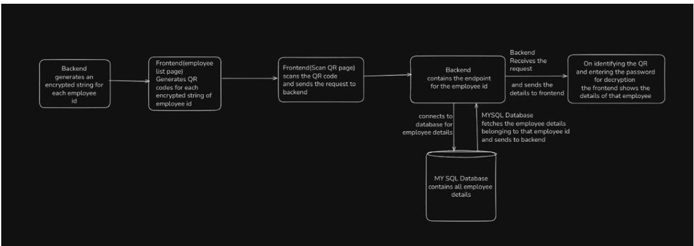
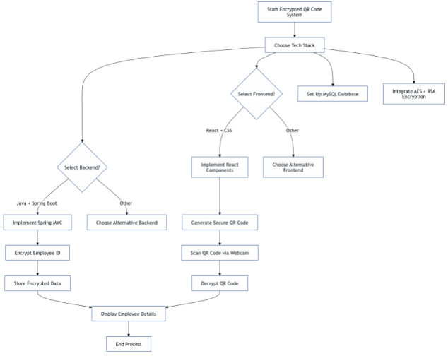

# Encrypted QR Code Generation System

A secure employee identification system that generates and validates encrypted QR codes using hybrid encryption techniques. The application enables organizations to securely generate, scan, and decrypt QR codes while protecting sensitive employee information.

> **Note**
> This project was developed during my internship at Nuclear Fuel Complex (NFC), Government of India. Due to organizational policies, the live application cannot be hosted publicly. This repository is intended to showcase the project architecture, implementation approach, and selected UI screens.

---

## Features

- Secure QR code generation for employee records
- AES encryption for employee data
- RSA encryption for AES key protection
- QR code scanning using webcam
- Secure employee data retrieval
- RESTful backend APIs
- MySQL database integration

---

## Tech Stack

### Frontend
- React.js
- JavaScript
- CSS
- html5-qrcode / react-qr-scanner

### Backend
- Java
- Spring Boot
- Spring MVC
- Spring Data JPA

### Database
- MySQL

### Security
- AES Encryption
- RSA Encryption
- Hybrid Encryption Model

### Libraries
- ZXing
- React QR Scanner

---

# System Architecture

> Replace the image below with your architecture diagram.



---

# Data Flow

> Replace the image below with your data flow diagram.



---

# Application Workflow

```text
Employee Details
        │
        ▼
Encrypt Employee ID (AES)
        │
        ▼
Encrypt AES Key (RSA)
        │
        ▼
Generate QR Code
        │
        ▼
Store Employee Record
        │
        ▼
Scan QR Code
        │
        ▼
Decrypt QR Data
        │
        ▼
Retrieve Employee Details
```

---

# Project Structure

```text
encrypted-qr-system/

├── frontend/
│   ├── src/
│   ├── components/
│   ├── pages/
│   └── services/
│
├── backend/
│   ├── controller/
│   ├── service/
│   ├── repository/
│   ├── entity/
│   └── encryption/
│
├── database/
│
├── screenshots/
│
└── README.md
```

---

# Screenshots

## Home Page

> Add screenshot


---

## Employee List

> Add screenshot


---

## Generated QR Code

> Add screenshot


---

## QR Scanner

> Add screenshot


---

## Employee Details After Decryption

> Add screenshot


---

# Security Workflow

- Employee information is stored securely.
- Employee IDs are encrypted using AES.
- AES encryption keys are protected using RSA.
- QR codes contain encrypted data instead of plain text.
- Decryption is performed only after successful verification.

---

# Key Highlights

- Secure QR based employee identification
- Hybrid encryption using AES and RSA
- Full stack application using React and Spring Boot
- REST API based communication
- Real time QR scanning
- Secure backend architecture

---

# Future Improvements

- Multi Factor Authentication (MFA)
- Role Based Access Control
- JWT Authentication
- HTTPS deployment
- Mobile application

---

# Note

This project was developed as part of an internship at **Nuclear Fuel Complex (NFC)**. Certain implementation details, deployment configuration, and production data cannot be shared publicly due to organizational confidentiality requirements. This repository demonstrates the application's architecture, development approach, and selected implementation screenshots for academic and portfolio purposes.
